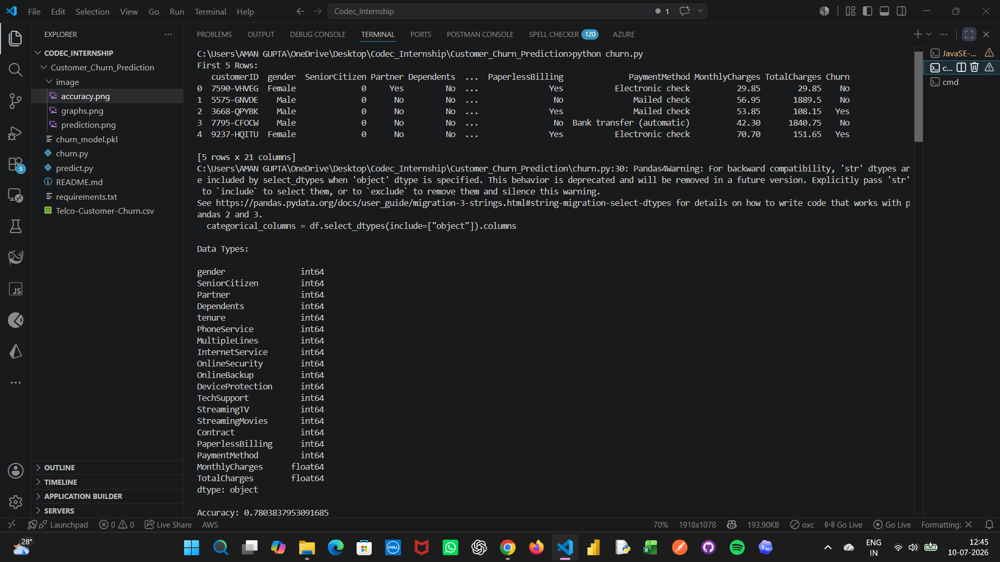
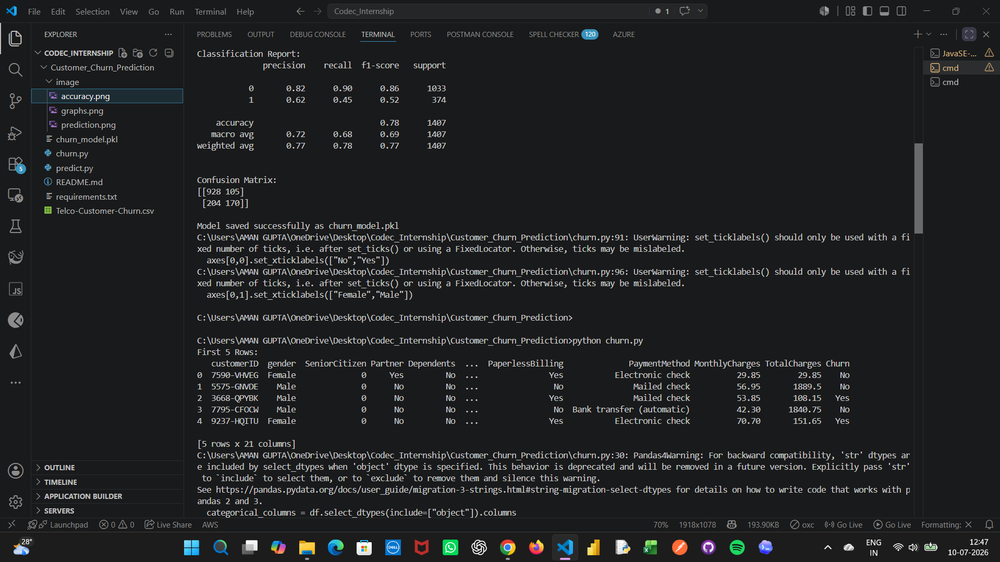
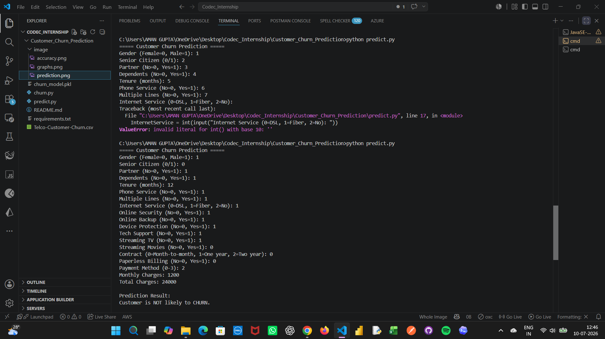
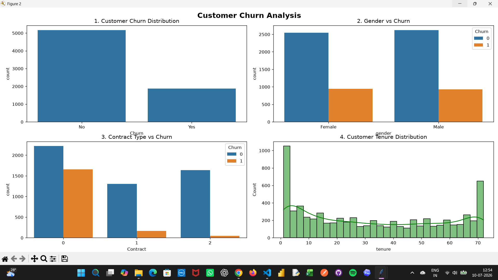

# Customer Churn Prediction

## Project Overview
This project predicts whether a telecom customer is likely to leave (churn) or not using Machine Learning. The model is trained on the Telco Customer Churn dataset using the Random Forest Classifier.

---

## Features
- Data Cleaning and Preprocessing
- Label Encoding for Categorical Data
- Random Forest Classification
- Model Evaluation
- Accuracy Score
- Classification Report
- Confusion Matrix
- Customer Churn Prediction using User Input

---

## Technologies Used
- Python
- Pandas
- NumPy
- Matplotlib
- Seaborn
- Scikit-learn
- Joblib

---

## Project Structure

Customer_Churn_Prediction/
│
├── churn.py
├── predict.py
├── churn_model.pkl
├── requirements.txt
├── README.md
└── Telco-Customer-Churn.csv

---

## Dataset
Dataset used:
Telco Customer Churn Dataset

---

## Model Used
Random Forest Classifier

---

## Model Accuracy
Accuracy: **78%**

---

## How to Run

### Install Required Libraries

```bash
pip install -r requirements.txt
```

### Train the Model

```bash
python churn.py
```

### Predict Customer Churn

```bash
python predict.py
```

---

## Sample Output

Prediction Result:

Customer is NOT likely to CHURN.

or

Customer is likely to CHURN.

---

## Output

### Model Accuracy



### Classification Report



### Prediction



### Graphs



## Author

Aman Gupta
B.Tech CS
3rd Year
